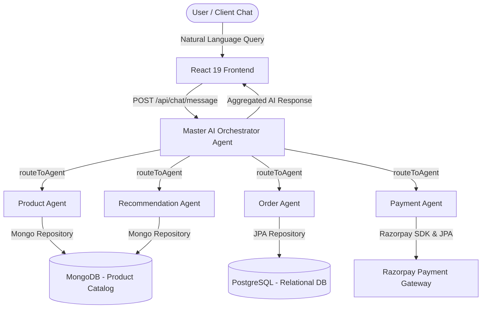

# 🤖 Agentic E-Commerce Platform

An autonomous, multi-agent AI-powered e-commerce ecosystem. The platform enables users to discover products, prepare orders, execute payments, and receive tailored recommendations through natural language conversations with a **Master AI Orchestrator** and **Specialized AI Agents**.

---

## 🌟 Key Features

- 🧠 **Master AI Agent Orchestration**: Uses **Spring AI** function calling to route intent dynamically across specialist sub-agents.
- 🛍️ **Autonomous Product Discovery (`ProductAgent`)**: Natural language catalog search, product detail retrieval, and filtering powered by MongoDB document store.
- 📦 **Smart Order Management (`OrderAgent`)**: Drafts, prepares, confirms, and cancels orders automatically based on chat interactions.
- 💳 **Seamless Razorpay Integration (`PaymentAgent`)**: Dynamic payment link creation, order verification, and Razorpay modal payment flow.
- 🎯 **Post-Purchase Recommendation Engine (`RecommendationAgent`)**: Suggests complementary products after successful order preparation or payment.
- 🔐 **Secure Authentication & RBAC**: JWT-based stateless authentication with password hashing for Users and Merchants.
- 🗄️ **Hybrid Dual-Database Architecture**:
  - **PostgreSQL**: Stores relational transactional entities (Users, Merchants, Addresses, Orders, Order Items, Payments).
  - **MongoDB**: Stores rich, flexible catalog document entities (Products, Categories, Attributes, Variants).
- 🎨 **Modern AI-Native Frontend**: React 19 + Vite SPA with TailwindCSS v4, Markdown rendering, Lucide icons, and real-time chat interface.

---

## 🏗️ Multi-Agent Architecture



### Agent Roles Overview

| Agent | Responsibility |
| :--- | :--- |
| **Master Orchestrator** | Receives user prompts, interprets multi-step intent, delegates via function calling (`routeToAgent`), and formats final client response. |
| **Product Agent** | Queries product inventory, filters by category/price, and provides detailed specifications. |
| **Order Agent** | Creates pending orders, confirms purchases, handles order cancellation, and retrieves order history. |
| **Payment Agent** | Generates Razorpay transaction IDs, checks payment status, and guides users through checkout. |
| **Recommendation Agent** | Analyzes order context to cross-sell and recommend relevant items. |

---

## 📁 Repository Structure

```
Agentic_Ecommerce/
├── Backend/                      # Spring Boot 3.4 / Java 17 Backend
│   ├── .env                      # Backend environment variables
│   ├── pom.xml                   # Maven dependencies (Spring AI, JPA, Mongo, Security, Razorpay)
│   └── src/main/
│       ├── java/com/ecom/Backend/
│       │   ├── ai/               # Master Orchestrator & Specialist AI Agents
│       │   │   ├── MasterOrchestratorAgent.java
│       │   │   └── agents/       # ProductAgent, OrderAgent, PaymentAgent, RecommendationAgent
│       │   ├── config/           # CORS, Security, Razorpay & DatabaseSeeder
│       │   ├── controller/       # REST Controllers (Chat, User, Merchant, Order, Payment, Product)
│       │   ├── dto/              # Data Transfer Objects
│       │   ├── entity/           # JPA & MongoDB Domain Entities
│       │   ├── repository/       # JPA & MongoDB Repositories
│       │   ├── security/         # JWT Filters & Token Provider
│       │   └── services/         # Core business logic services
│       └── resources/
│           └── application.properties # Spring application configuration
│
├── Frontend/                     # React 19 + Vite Frontend
│   ├── index.html                # HTML entry point with Razorpay Checkout Script
│   ├── package.json              # NPM dependencies (React 19, TailwindCSS v4, Lucide)
│   ├── vite.config.js            # Vite configuration
│   └── src/
│       ├── components/
│       │   ├── auth/             # Login / Register forms & Route guards
│       │   ├── chat/             # ChatFeed, ChatInput, TypingIndicator
│       │   ├── layout/           # Header, Sidebar navigation
│       │   ├── MarkdownRenderer.jsx # Rich Markdown AI message renderer
│       │   └── RazorpayCheckoutButton.jsx # Razorpay checkout modal handler
│       ├── App.jsx               # Application routing & context state
│       ├── index.css             # TailwindCSS imports & global theme
│       └── main.jsx              # React app entry point
└── README.md                     # Project documentation
```

---

## 🛠️ Tech Stack & Dependencies

### Backend
- **Framework**: Spring Boot 3.4+ / Java 17
- **AI Integration**: Spring AI (`spring-ai-starter-model-openai` configured for Google Gemini API or Ollama)
- **Databases**: PostgreSQL (Relational) & MongoDB (Document store)
- **Security**: Spring Security + JJWT (`io.jsonwebtoken`)
- **Payment Gateway**: Razorpay Java SDK (`com.razorpay:razorpay-java`)
- **Utilities**: Lombok, OkHttp3

### Frontend
- **Framework**: React 19 SPA
- **Build Tool**: Vite
- **Styling**: TailwindCSS v4
- **Icons**: Lucide React
- **Markdown Processing**: React Markdown ecosystem (for structured agent responses)

---

## ⚙️ Environment Configuration

Create or verify the `.env` file inside the `Backend/` directory:

```env
# Database Credentials
SPRING_DATASOURCE_USERNAME=postgres
SPRING_DATASOURCE_PASSWORD=test

# LLM Configuration (Google Gemini / OpenAI compatible API)
GEMINI_BASE_URL=https://generativelanguage.googleapis.com/v1beta/openai/
GEMINI_API_KEY=your_gemini_api_key_here
GEMINI_MODEL=gemini-3.6-flash

# JWT Configuration
JWT_SECRET=YourSuperSecretKeyForJWTTokenGeneration2026AdvancedAgenticEcommerce
JWT_EXPIRATION=86400000

# Razorpay Credentials (Test Mode)
RAZORPAY_KEY_ID=your_razorpay_key_id
RAZORPAY_KEY_SECRET=your_razorpay_key_secret
```

---

## 🚀 How to Run

### Prerequisites

Ensure you have the following installed on your machine:
- **Java JDK 17** or higher
- **Node.js** (v18+) & **npm**
- **PostgreSQL** running locally on port `5432` with database `ecommerce`
- **MongoDB** running locally on port `27017` with database `ecommerce`

---

### Step 1: Database Setup

1. Create a PostgreSQL database named `ecommerce`:
   ```sql
   CREATE DATABASE ecommerce;
   ```
2. MongoDB will automatically create the `ecommerce` database upon connection.

---

### Step 2: Start Backend Server

1. Open a terminal and navigate to the `Backend` directory:
   ```bash
   cd Backend
   ```
2. Configure your environment variables in `Backend/.env`.
3. Run the Spring Boot application using Maven:
   ```bash
   # Windows
   mvnw.cmd spring-boot:run

   # macOS / Linux
   ./mvnw spring-boot:run
   ```
   *Note: On initial launch, `DatabaseSeeder` automatically populates MongoDB with sample tech catalog items (MacBooks, iPhones, Keyboards, Monitors).*
4. Backend API will run on `http://localhost:8080`.

---

### Step 3: Start Frontend Server

1. Open a new terminal and navigate to the `Frontend` directory:
   ```bash
   cd Frontend
   ```
2. Install Node dependencies:
   ```bash
   npm install
   ```
3. Start the Vite development server:
   ```bash
   npm run dev
   ```
4. Access the frontend application at `http://localhost:5173`.

---

## 🧪 Testing the Agentic Experience

1. **Sign Up / Log In**: Register a new user account on the frontend.
2. **Chat with AI Assistant**:
   - **Product Queries**: *"Show me laptops under ₹100,000"* or *"Tell me about the MacBook Air M2"*.
   - **Order Preparation**: *"I want to buy 1 unit of MacBook Air M2"*.
   - **Payments**: Click the **Pay with Razorpay** button in the chat response to complete test payments.
   - **Order Tracking**: *"Show my order history"* or *"Cancel order #1"*.
